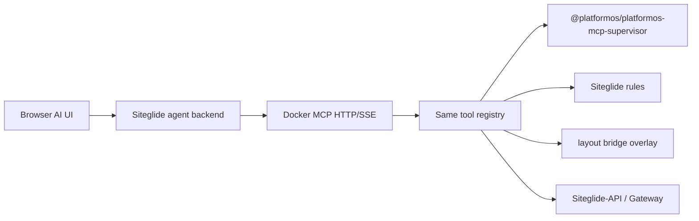
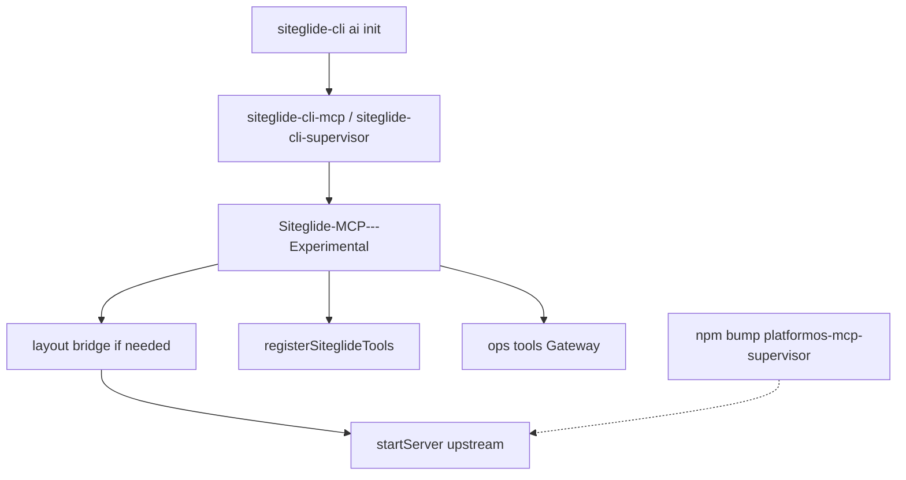
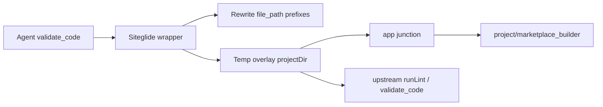

# Siteglide-MCP desktop + CLI wrappers

## MCP home (locked)

All Siteglide MCP implementation lives in [`d:\git\Siteglide-MCP---Experimental`](d:\git\Siteglide-MCP---Experimental) — not inside the CLI package tree.

| Keep in `siteglide-cli` | Put in `Siteglide-MCP---Experimental` |
| --- | --- |
| `ai init` (writes config pointing at MCP bins) | Composed supervisor (`validate_code` + Siteglide rules) |
| Thin wrapper bins that call / spawn the MCP package | Operational MCP tools (`envs_list`, `graphql_exec`, `liquid_exec`, `logs_fetch`) |
| | Modular `rules/` / `guides/` data |
| | **Layout bridge** (`marketplace_builder` ↔ `app` temp overlay) |
| | Future HTTP/SSE + Docker image |

**Not in scope:** CLI `exec graphql|liquid` — agents use MCP ops tools; humans can use existing GUI evaluators.
**Why separate:** independent versioning, npm-bump of `@platformos/platformos-mcp-supervisor` without a CLI release, reusable by web agents / Docker without installing the whole CLI, cleaner boundary for Siteglide rules.

**How CLI consumes it:** `siteglide-cli` depends on or invokes this repo’s published package / bins; `siteglide-cli mcp` / `supervisor` are thin launchers; `ai init` registers those commands.

## Docker / browser later

**Yes**, if transports stay swappable.

- **v1:** stdio — Cursor / Claude Code / local agents
- **Later:** HTTP + SSE (or streamable HTTP); browser → Siteglide agent BFF → Docker MCP (no secrets in the browser)



**Not in v1:** shipping HTTP/Docker — only design so tool registration is transport-agnostic.

## Scope

1. **`Siteglide-MCP---Experimental`** — compose upstream check engine + Siteglide rules + ops tools + layout bridge
2. **`siteglide-cli ai init`** — register MCP bins
3. **Thin CLI wrappers** for `mcp` / `supervisor`

No Siteglide-API changes. Do not fork `platformos-tools`. No CLI `exec` command.

## Two supervisors (use the new one)

| Version | Use? |
| --- | --- |
| Legacy `pos-supervisor` | No |
| `@platformos/platformos-mcp-supervisor` (platformos-tools) | **Yes** |

## Compose, do not fork (update-friendly)

Upstream embedding API:

- `startServer({ projectDir })` → `{ server, context, shutdown }`
- `registerValidateCode(server, context)`
- `ValidateCodeResult` types

In `Siteglide-MCP---Experimental`:

1. Detect layout; if needed, create **temp overlay bridge** → `bridgedProjectDir`
2. `startServer` / lint against bridged dir (rewrite `file_path` for agents using `marketplace_builder/...`)
3. `registerSiteglideTools(server, …)` on the **same** `McpServer`
4. Ops tools (sibling stdio entry or same process)
5. Bump `@platformos/platformos-mcp-supervisor` for pOS updates — Siteglide rules/bridge unchanged unless public API breaks



### Layout (in MCP repo)

```
Siteglide-MCP---Experimental/
  src/supervisor/compose.js    # bridge + startServer + registerSiteglideTools
  src/layout/
    detect.js                  # app | marketplace_builder | null
    bridge.js                  # create/destroy temp overlay
    rewritePath.js             # path rewrite for validate_code
  src/siteglide/register.js
  src/siteglide/rules/
  src/siteglide/guides/
  src/ops/                     # envs-list, graphql-exec, liquid-exec, logs-fetch
  src/stdio.js                 # stdio transport bootstrap
  src/http.js                  # deferred — same registerTools for later Docker
```

## Path bridge (locked interim)

platformOS **already** classifies `marketplace_builder/` files (`getFileType` / `isKnownLiquidFile` in platformos-common). Gaps remain: `getAppPaths` / `DocumentsLocator` search **`app/` only**; some checks hardcode `app/...`. Native LSP support was asked of platformOS; until that ships, Siteglide uses an interim bridge.

**Do not** create `app` → `marketplace_builder` inside the customer project (git noise, deploy confusion).

**Do** build a **session temp overlay** before lint:

```
<tmpdir>/siteglide-mcp-bridge-XXXX/
  app/          → junction/symlink to <project>/marketplace_builder
  modules/      → junction/symlink to <project>/modules   (if present)
  .platformos-check.yml  (copy from project if present, else minimal stub)
```



### When to activate

| Project state | Bridge? |
| --- | --- |
| Only `marketplace_builder/` (no real `app/`) | **Yes** |
| Real `app/` exists | **No** |
| Both exist | **No** — prefer real `app/`; log once |
| Only `modules/` | **No** |

Detect real `app/` with `fs.lstat` (don’t nest or delete foreign symlinks/junctions).

### Cross-platform links

| OS | Directory link type | Notes |
| --- | --- | --- |
| Windows | `'junction'` | No admin / Developer Mode for directory junctions |
| macOS / Linux | `'dir'` (or default) | Standard symlink |

Normalize paths to `/` for MCP/agent strings; `path.resolve` absolute targets before linking.

Lifecycle: create once at MCP start → reuse for all `validate_code` → destroy on `shutdown()` / process exit.

### file_path rewrite

When bridge active: map `marketplace_builder/...` (relative or absolute under project) → overlay `app/...`; accept `app/...` relative to overlay. **v1:** diagnostics may still say `app/...` (alias documented via skills); optional reverse-map later.

### validate_code wiring

Prefer public lint API from the supervisor package (`runLint` / equivalent) behind `runValidateCodeWithBridge`. If only `startServer` is exported, use documented lower-level registration; avoid monkey-patching. Fallback to check-node only if supervisor exports are insufficient.

### Bridge tests

- detect: only-mb → bridge; only-app → no; both → no
- rewritePath: relative + absolute (win32/posix fixtures)
- overlay create/destroy + readable `app/...` through junction
- smoke: lint fixture under `marketplace_builder` via bridged `validate_code`

### Bridge out of scope

- Patching `platformos-tools` in our tree
- Persistent in-repo `app` symlinks
- Keeping the bridge forever after upstream native support (remove when they ship and we bump)

## Decisions (locked)

### MCP (`Siteglide-MCP---Experimental`)
- Compose upstream check engine + Siteglide rules
- Ops MVP: `envs_list`, `graphql_exec`, `liquid_exec`, `logs_fetch`
- **Layout bridge:** temp overlay when only `marketplace_builder/` (cross-platform junctions/symlinks)
- **v1 transport: stdio only**; transport-agnostic registration for HTTP/Docker later
- Auth for ops: `.siteglide-config` / `MPKIT_*` / explicit params (HTTP auth later)
- Upstream `validate_code` needs **no** Siteglide auth; ops tools do

### ai init (CLI)
- Registers `siteglide-cli-mcp` + `siteglide-cli-supervisor` (wrappers → MCP repo)

### Skills vs MCP
- Skills = guidance (temporary `Siteglide-AI-Skills`; later modules/CLI install)
- MCP = callable tools; they coexist
- Rules/skills cannot alone fix `app/` search paths — bridge handles that until pOS does

### Not shipping
- CLI `exec graphql|liquid` (undone; MCP ops cover agent GraphQL/Liquid)

## Phases

### 1 — scaffold `Siteglide-MCP---Experimental`
Compose supervisor + layout bridge + Siteglide guide/rules tool + ops MVP + stdio entries

### 2 — wire CLI
Depend on / invoke MCP package; `ai init`; thin `mcp` / `supervisor` bins

### 3 — (later)
HTTP/SSE, Dockerfile, web agent BFF auth; drop bridge when upstream marketplace_builder support is enough

## Next — Windows git index after `marketplace_builder` → `app`

**Symptom:** After pull migrate on Windows, git shows ~10k changed files (mass delete + add) instead of renames.

### Research takeaways (why “just git mv harder” is the wrong goal)

Git does **not** store renames. It stores snapshots; `git status` / `git diff` *detect* renames by pairing deletes with adds ([torek / SO](https://stackoverflow.com/questions/60185482/git-mv-did-not-flag-every-file-as-renamed-several-are-deleted-added), [Dynamics blog](https://community.dynamics.com/blogs/post/?postid=24c0d875-2cc4-45d1-996a-a56a753eaca2)):

- **Exact renames** (identical blob hash): linear, fast, works for thousands of files — `git mv` and `mv` + `git add -A` are equivalent for history.
- **Inexact renames** (path moved *and* content changed): quadratic; skipped when pair count exceeds `diff.renameLimit` / `status.renameLimit` (default historically ~1000). Then status shows raw `D`/`A` for the whole tree — matches the ~10k churn symptom.
- Mixing a directory rename with a full site zip overwrite in one unstaged/staged blob is exactly the inexact-rename trap: hashes no longer match, limit kicks in, UI looks broken.
- Windows `fatal: bad source` on `git mv *` is usually shell globbing ([git-for-windows#3250](https://github.com/git-for-windows/git/issues/3250)); our code already uses `execFile` + `git.exe` without globs. Remaining `git mv` failures are secondary — FS rename is fine if the **index timing** is right ([git-for-windows#1750](https://github.com/git-for-windows/git/issues/1750): Explorer move needs `git add -A` to sync index).

### Chosen approach (concrete)

In [`lib/migrateAppDirectory.js`](d:\git\siteglide-cli\lib\migrateAppDirectory.js) + [`siteglide-cli-pull.js`](d:\git\siteglide-cli\siteglide-cli-pull.js):

1. **Diagnose once on a real Windows site** (migrate-only pause or debug flag): after disk rename + index update, *before* unzip, run `git -c status.renameLimit=0 status --short` / `git diff --cached --name-status -M100%`. Expect mostly `R100%`. If not, fix staging first.
2. **Prefer FS rename + immediate index sync** (keep `git mv` as optional fast path only): `fs.move(marketplace_builder, app)` then `git add -A -- app marketplace_builder` while on-disk content still matches HEAD blobs → stages **exact** renames into the index.
3. **Then** download/unzip into `app/` (existing pull). Do **not** re-run a combined `git add -A` over both old and new roots after content rewrite in a way that re-pairs D/A across the rename; after unzip only stage under `app/` (`git add -A -- app`) so post-pull churn is **modifications** (and new files) under `app/`, with the path rewrite already recorded.
4. **Log clearly** after migrate: rename staged; any large remaining status after pull is site content sync under `app/`, not a failed folder move.
5. **Verify**: migrate-only → `R` lines; full pull → no mass `D marketplace_builder` + `A app` for the same relative paths; Cursor/git status should not look like 10k delete+add of the whole tree.

Do **not** rely on raising global `renameLimit` as the primary fix (helps display of inexact pairs, does not fix mixing rename+content). Do **not** require a mid-pull commit from the CLI (user commits when ready; commit is when rename detection is clearest in history/UIs).

### Removed — `siteglide-cli test-rename`

Harness and Jest migrate fixture removed once rename staging was confirmed; keep FS rename + staged path rewrite in pull only.

## Out of scope (this pass)

- CLI `exec` command
- Implementing Docker/HTTP hosting now
- Forking platformos-mcp-supervisor
- Legacy pos-supervisor / `load_development_guide`
- Full pos-cli mcp-min parity
- Patching upstream pos-cli / platformos-tools
- Persistent customer-repo `app` symlinks

## Usage (target)

```bash
siteglide-cli pull staging
siteglide-cli mcp
# Later: docker run … siteglide-mcp --transport http --port 5910
```
